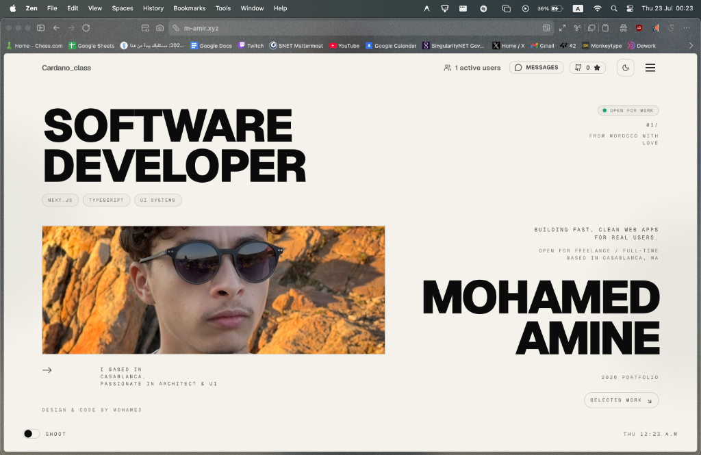

# Mohamed Amine - Software Developer Portfolio


[](https://m-amir.xyz/)

> **Building fast, clean web apps for real users.**  
> Open for freelance & full-time opportunities. Based in Casablanca, Morocco.

---

## 🚀 Live Demo
🌐 **Website:** [https://m-amir.xyz/](https://m-amir.xyz/)

---

## ✨ Features
- **Minimalist Design & Architecture**: Clean typography, elegant aesthetic, and subtle micro-interactions.
- **3D & Interactive Visuals**: Powered by Three.js / React Three Fiber and GSAP / Framer Motion animations.
- **Smooth Scrolling**: Lenis smooth scrolling integration.
- **Collaborative Real-time Cursors**: Live peer cursors enabled via Supabase Realtime.
- **Dynamic Projects & Details**: Dedicated project showcases and detail pages.
- **Fully Responsive & Dark/Light Theme**: Seamless support across all screen sizes and preference modes.

---

## 🛠️ Tech Stack
- **Framework**: [Next.js](https://nextjs.org/) (App Router)
- **Language**: [TypeScript](https://www.typescriptlang.org/)
- **Styling**: [Tailwind CSS](https://tailwindcss.com/)
- **Animations & 3D**: [Three.js](https://threejs.org/) / React Three Fiber, [GSAP](https://gsap.com/), [Framer Motion](https://www.framer.com/motion/)
- **Smooth Scroll**: [Lenis](https://lenis.darkroom.engineering/)
- **Realtime**: [Supabase](https://supabase.com/)
- **Deployment**: [Vercel](https://vercel.com/)

---

## 💻 Local Development

1. **Clone the repository:**
   ```bash
   git clone https://github.com/Cardano04class/portfolio-website.git
   cd portfolio-website
   ```

2. **Install dependencies:**
   ```bash
   npm install
   ```

3. **Run the development server:**
   ```bash
   npm run dev
   ```

4. **Open in browser:**  
   Navigate to `http://localhost:3000`

---

## 📬 Connect with Me
- **Portfolio:** [https://m-amir.xyz/](https://m-amir.xyz/)
- **GitHub:** [https://github.com/Cardano04class](https://github.com/Cardano04class)
- **Location:** Casablanca, Morocco 🇲🇦

---
*Design & Code by Mohamed Amine*
